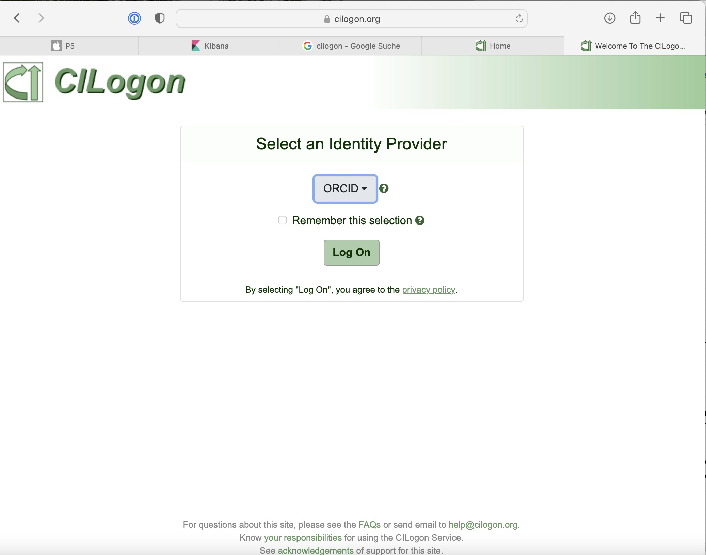
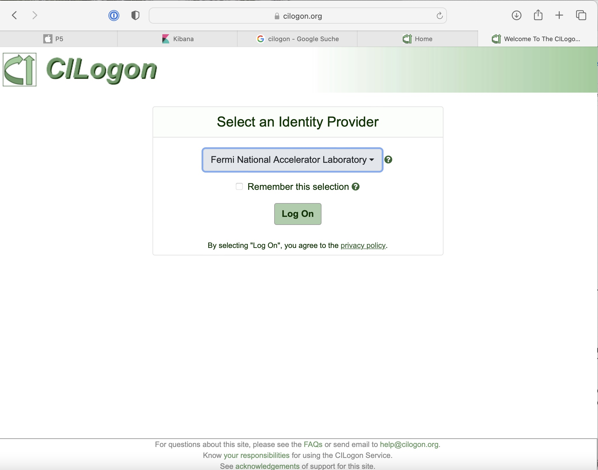
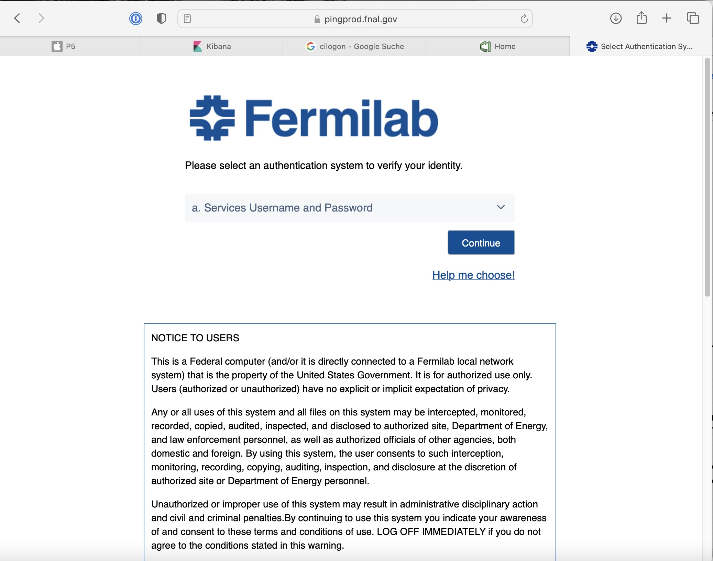
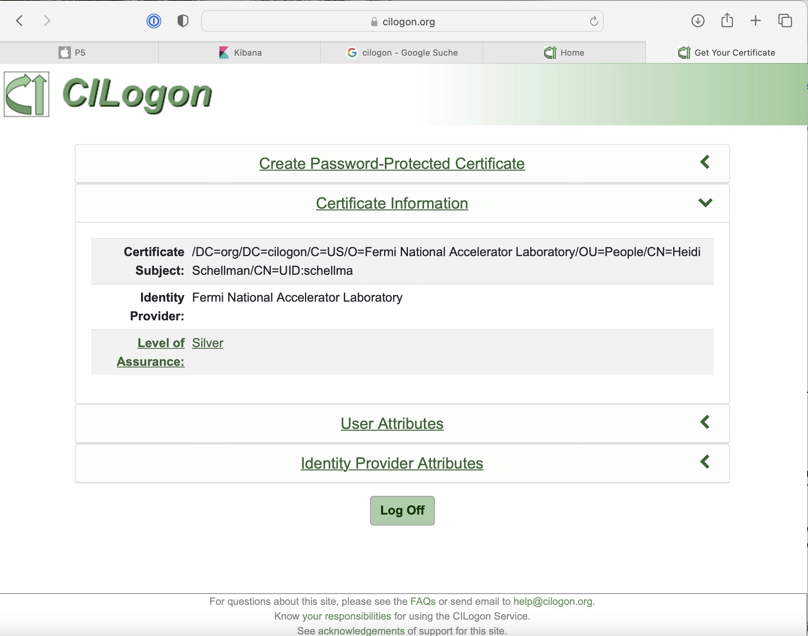
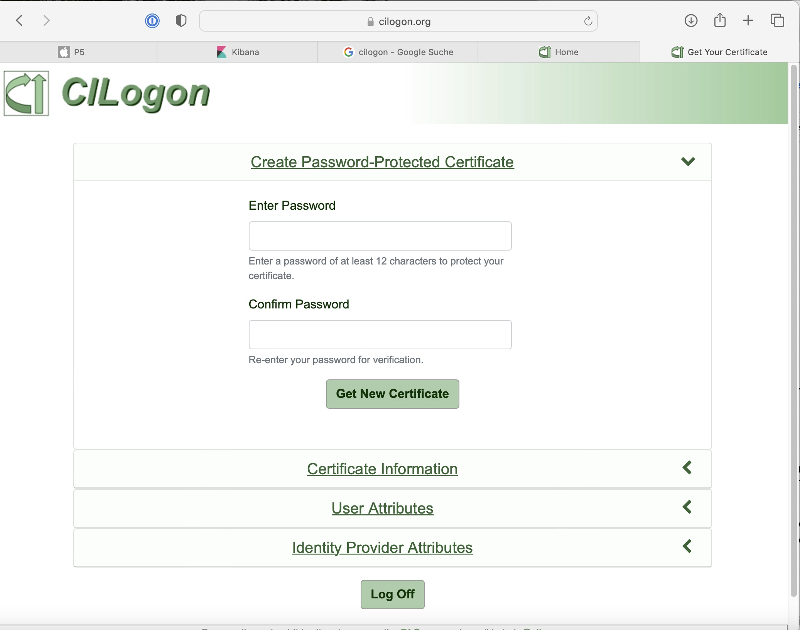

# Getting credentials from CILogon.org for jobsub_lite

1. go to CILogon.org  (https://cilogon.org)

2. Choose Fermi National Accelerator Lab as your identity provider and log in.

3. Check to see if you already have a certificate from them.

4. If not, create a certificate:

5. You can now log out I think.  You will have a credential which can be used (almost magically) to access DUNE CPU and storage.   This is an alternative to the KX509 and proxies we've used in the past.  You may need to login in to CILogon occasionally if your credentials expire but you don't need to do the password part each time. 

6. There is an example of job submission using this authentication method at:

https://fifewiki.fnal.gov/wiki/Getting_started_with_jobsub_lite#More_Explanation_about_Tokens

this is still under test.
